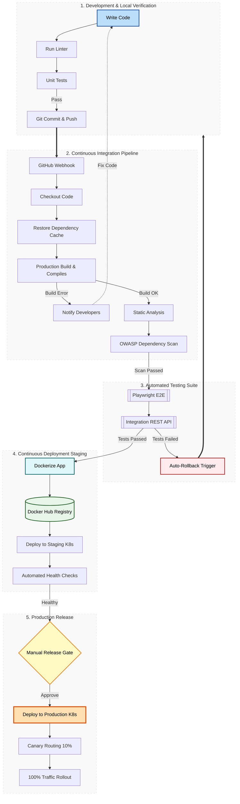

# ArtyMD Capabilities Verification File

This document contains complex elements (advanced **Mermaid diagrams** and **KaTeX math formulas**) designed to verify the status and correctness of the rendering pipelines within the application.

---

## 1. Mathematical Rendering (KaTeX)

Here we test both **inline** math formulas and **display block** equations.

### 1.1 Inline Mathematics
The normal distribution probability density function is represented by $f(x) = \frac{1}{\sigma\sqrt{2\pi}} e^{-\frac{1}{2}\left(\frac{x-\mu}{\sigma}\right)^2}$. 
Euler's famous identity combining five fundamental mathematical constants is: $e^{i\pi} + 1 = 0$.

### 1.2 Complex Display Block Equation
The following block demonstrates multiline systems, matrices, integrals, and limits:

$$\begin{aligned}
\mathbf{A} &= \begin{pmatrix} 
a_{11} & a_{12} & \cdots & a_{1n} \\
a_{21} & a_{22} & \cdots & a_{2n} \\
\vdots & \vdots & \ddots & \vdots \\
a_{m1} & a_{m2} & \cdots & a_{mn} 
\end{pmatrix} \\
\int_{a}^{b} f(x) \, dx &= \lim_{n \to \infty} \sum_{i=1}^{n} f(x_i^*) \Delta x_i \\
\nabla \times \mathbf{E} &= -\frac{\partial \mathbf{B}}{\partial t}
\end{aligned}$$

---

## 2. Advanced Mermaid Diagram

This system architecture flowchart tests subgraphs, node boundaries, and custom link styling:

---

## 3. Standard Layout Verification

Check table layouts and list nesting:

| Component | Technology | Role |
| :--- | :---: | :--- |
| **View UI** | Svelte 5 | Layout, Zoom/Pan & File Watchers |
| **Math Renderer** | KaTeX | High-performance LaTeX formatting |
| **Diagram Engine** | Mermaid.js | Declarative text-to-diagram converter |

- Supported Features:
  - Custom tabs for multiple concurrent open documents.
  - Debounced auto-reload when the active file is modified externally.
  - Styled Print / PDF exporting system.
